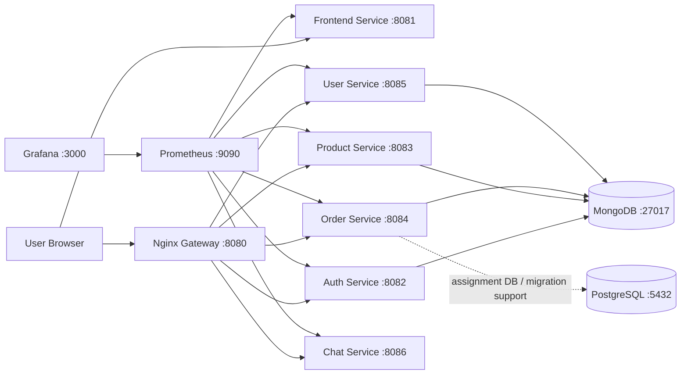

# 1. Титульный лист (Title Page)

**Учебное заведение / курс:**  
[Укажите университет], [Укажите курс/дисциплину]

**Тема:**  
Design and Deployment of a Containerized Microservices System with Terraform and Incident Response Simulation

**Студент / группа:**  
[Ваше ФИО], [Ваша группа]

**Дата:**  
[Укажите дату]

---

# 2. Введение (Introduction)

## Краткое описание проекта

**Clothes Store** — это контейнеризированная микросервисная e-commerce система, построенная на Go (Gin), с единым API Gateway (Nginx), отдельными доменными сервисами (Auth, Product, Order, User, Chat), веб-фронтендом, мониторингом (Prometheus + Grafana) и инфраструктурой как код (Terraform для AWS EC2).

## Цели и задачи

1. Спроектировать и реализовать микросервисную архитектуру интернет-магазина.
2. Контейнеризировать все компоненты через Docker и оркестрировать запуск через Docker Compose.
3. Реализовать мониторинг и алертинг для ключевых сервисов и метрик.
4. Описать инфраструктуру в Terraform и автоматизировать развертывание VM.
5. Провести симуляцию инцидента (отказ Order Service), выполнить обнаружение, анализ и восстановление.
6. Подготовить постмортем и список профилактических action items.

---

# 3. Архитектура системы (System Architecture)

## Схема архитектуры



## Описание стека и обоснование

- **Backend: Go + Gin** — высокая производительность, простая сборка в один бинарник, удобен для микросервисов.  
  > Примечание: в этой реализации используется **Go/Gin** (не FastAPI).
- **Frontend:** Go templates + HTML/CSS/JS — легковесный UI без тяжелого SPA-фреймворка.
- **Gateway: Nginx** — единая точка входа, маршрутизация запросов к сервисам.
- **Databases:** MongoDB (основные данные приложения), PostgreSQL (доп. контейнер для требований задания/миграционных сценариев).
- **Containerization:** Docker + Docker Compose — воспроизводимость окружения и быстрый локальный/серверный запуск.
- **IaC:** Terraform — декларативное и повторяемое развертывание инфраструктуры.
- **Monitoring:** Prometheus + Grafana + alerts.yml — наблюдаемость и оперативное обнаружение деградаций.

## Скриншоты (опционально)

- _(Вставьте скриншот структуры проекта в IDE)_

---

# 4. Инфраструктура как код (Assignment 5: Terraform)

## Описание ресурсов

Terraform-конфигурация создает:

1. **EC2 VM (Ubuntu 22.04)** с публичным IP.
2. **Security Group** с входящими правилами для SSH (22), HTTP (80), gateway (8080), Grafana (3000), Prometheus (9090).
3. **Cloud-init / user_data** для установки Docker Engine + Docker Compose plugin и опционального деплоя репозитория.

## Конфигурация (сокращенно)

### `terraform/main.tf` (фрагмент)
```hcl
resource "aws_security_group" "app" {
  # ingress 22, 80, 8080, 3000, 9090
}

resource "aws_instance" "app" {
  ami           = data.aws_ami.ubuntu.id
  instance_type = var.instance_type
  key_name      = var.key_name
  user_data     = templatefile("${path.module}/user_data.sh.tftpl", { ... })
}
```

### `terraform/variables.tf` (фрагмент)
```hcl
variable "aws_region"   { default = "us-east-1" }
variable "instance_type"{ default = "t3.micro" }
variable "app_ports"    { default = [80, 8080, 3000, 9090] }
variable "key_name"     { type = string }
```

### `terraform/outputs.tf` (фрагмент)
```hcl
output "public_ip"      { value = aws_instance.app.public_ip }
output "app_url"        { value = "http://${aws_instance.app.public_ip}:8080" }
output "prometheus_url" { value = "http://${aws_instance.app.public_ip}:9090" }
output "grafana_url"    { value = "http://${aws_instance.app.public_ip}:3000" }
```

## Процесс развертывания

```bash
cd terraform
terraform init
terraform plan
terraform apply
```

## Результат

После `terraform apply` выводятся:

- `public_ip = <PUBLIC_IP>`
- `app_url = http://<PUBLIC_IP>:8080`
- `prometheus_url = http://<PUBLIC_IP>:9090`
- `grafana_url = http://<PUBLIC_IP>:3000`

## Скриншоты

1. _(Терминал с успешным `terraform apply`)_
2. _(Панель AWS/GCP/Azure/DO с созданной VM и публичным IP)_

---

# 5. Контейнеризация и оркестрация (Docker & Docker Compose)

## Описание `docker-compose.yml`

Система запускает сервисы:

- `gateway` (Nginx)
- `frontend`
- `auth-service`
- `product-service`
- `order-service`
- `user-service`
- `chat-service`
- `mongo`
- `postgres`
- `prometheus`
- `grafana`

## Сети и переменные окружения

- Взаимодействие сервисов выполняется через внутреннюю Docker-сеть по service-name DNS (например, `mongo`, `order-service`).
- Ключевые переменные: `MONGODB_URI`, `JWT_SECRET`, `BACKEND_PORT`, URL внутренних сервисов для frontend.
- Gateway пробрасывается наружу на `8080`, frontend — `8081`.

## Скриншоты

1. _(Вывод `docker ps -a`, все нужные контейнеры в статусе Up)_
2. _(Главная страница frontend в браузере)_

---

# 6. Мониторинг и наблюдаемость (Monitoring)

## Настройка Prometheus

В `prometheus.yml` настроены `scrape_configs` для:

- `frontend:8081/metrics`
- `auth-service:8082/metrics`
- `product-service:8083/metrics`
- `order-service:8084/metrics`
- `user-service:8085/metrics`
- `chat-service:8086/metrics`

Алерты в `alerts.yml`:

- `HighLatencyWarning`
- `HighErrorRateCritical`
- `ServiceDown`

## Настройка Grafana

- Datasource: `Prometheus` (`http://prometheus:9090`)
- Автопровижининг dashboard-провайдера: `Clothes Store Dashboards`
- Основной дашборд: **Clothes Store Overview**
- Примеры панелей: `Services Up`, `Error Rate`, `P95 Latency`, `Request Rate by Service`, `Service Availability`

## Скриншоты

1. _(Prometheus Targets, все сервисы со статусом UP)_
2. _(Grafana Dashboard с ключевыми графиками)_

---

# 7. Симуляция инцидента (Assignment 4: Incident Response)

## Сценарий

Инцидент создан через override-файл `docker-compose.incident.yml`, где для `order-service` задан неверный URI БД:

```env
MONGODB_URI=mongodb://wrong-mongo-host:27017
```

Команда симуляции:

```bash
docker compose -f docker-compose.yml -f docker-compose.incident.yml up -d order-service
```

## Detection

Признаки инцидента:

- деградация/падение `order-service` в мониторинге;
- ошибки 5xx на order endpoints;
- падение показателей availability для order-service.

Проверка:

```bash
docker compose ps
docker compose logs order-service
```

## Analysis

Логи подтверждают ошибку подключения к MongoDB из-за неверного hostname (service DNS не резолвится):

```text
dial tcp: lookup wrong-mongo-host on 127.0.0.11:53: no such host
```

## Mitigation

Восстановление конфигурации и перезапуск сервиса:

```bash
docker compose -f docker-compose.yml up -d order-service
```

После фикса `order-service` снова становится доступным, графики и метрики возвращаются к норме.

## Скриншоты

1. _(График Grafana с провалом во время инцидента)_
2. _(Логи ошибки в терминале)_
3. _(Графики после восстановления)_

---

# 8. Постмортем анализ (Postmortem Analysis)

## Summary

В ходе симуляции произошел отказ `order-service` из-за ошибки конфигурации `MONGODB_URI`. По timeline инцидента сервис был недоступен в пределах короткого окна восстановления (порядка нескольких минут).

## Impact

Затронуты пользователи, выполнявшие операции заказа:

- создание заказа;
- просмотр истории заказов;
- проверка статуса заказа.

Остальные функции (каталог, auth, user, chat) оставались доступными.

## Root Cause

- Основная причина: человеческая ошибка в конфигурации окружения (неверный hostname БД).
- Сопутствующие факторы: отсутствие предварительной валидации конфигов и readiness-проверки зависимости БД до rollout.

## Action Items

1. Добавить startup/readiness проверку соединения с БД в каждом backend-сервисе.
2. Добавить CI-проверки обязательных переменных окружения и формата URI.
3. Ограничить `ssh_cidr` в Terraform до доверенного IP диапазона.
4. Усилить алертинг по `ServiceDown` и error-rate для критичных сервисов.
5. Регулярно проводить game day / incident simulation перед релизом.

---

# 9. Заключение (Conclusion)

В рамках работы была реализована и проанализирована полноценная микросервисная система с практиками IaC и SRE: от инфраструктуры (Terraform) и контейнеризации (Docker Compose) до наблюдаемости (Prometheus/Grafana) и управления инцидентами (симуляция, диагностика, восстановление, постмортем).  
Ключевой результат — подтверждение, что автоматизированное развертывание и заранее подготовленные процедуры мониторинга/response существенно сокращают время обнаружения и устранения отказов.
